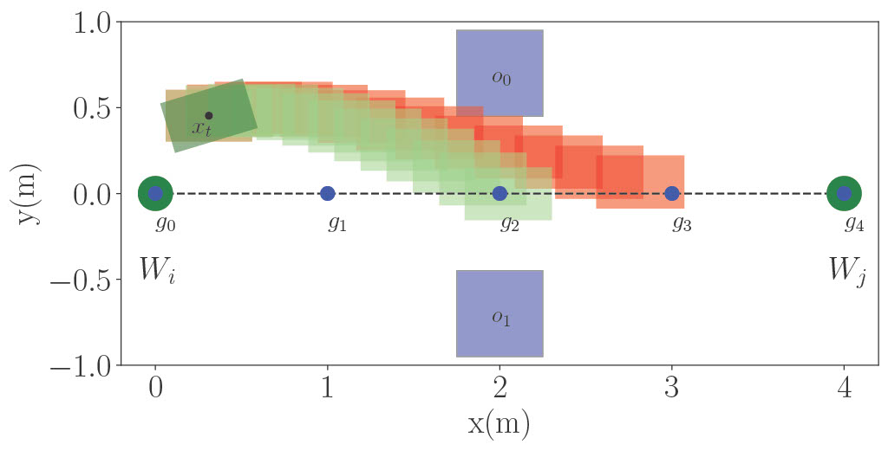
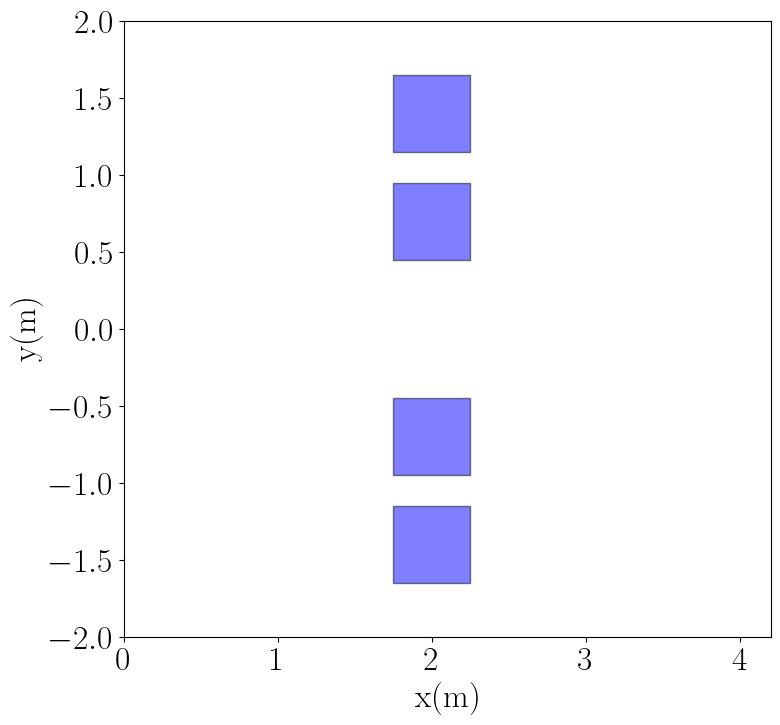
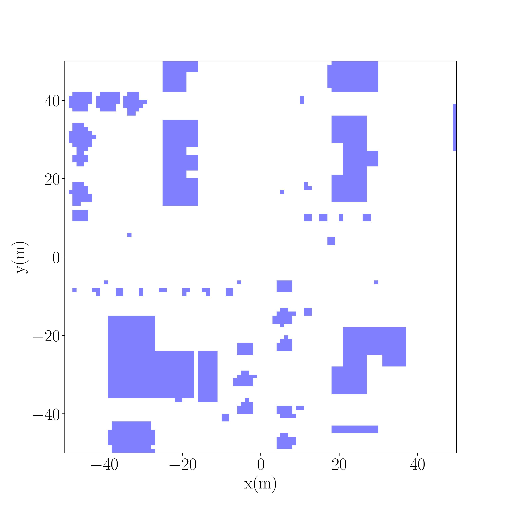

# RusTReach: A real time reachability tool written in Rust



A package for constructing the set of reachable states for a system over a finite-time horizon. The set of reachable states is over-approximated as a sequence of hyperrectangles ("boxes") for simplicity and efficiency using a mixed-face lifting approach from Johnson et al. [1]. The original approach was an anytime algorithm implemented in C and considers fixed control over a short finite-time horizon. RusTReach is implemented in Rust for memory-safety and efficiency and supports both fixed control and dynamic control, from a reinforcement learning (RL) policy, over a short finite-time horizon. 

The anytime property decreases over-approximation error proporitional to the step size used. A larger step size will compute quickly but with more error, whereas a smaller step size is more accurate but will require more computation time. The anytime approach, given a runtime deadline, first computes the set of states given an initial step size, then if time is left re-computes by halving the step size. This is repeated until time has expired.

We implement two example systems: A bicycle model for an F1/10 automonous ground vehicle and a linearized quadcopter model of a DJI F450.

We develop an algorithm to safely navigate between a sequence of waypoints given system dynamics and model weights learned via goal-conditioned RL (pretrained model weights are in `models/`). Intermediate subgoals are selected between two waypoints to condition goal-conditioned RL policies to control the system such that collisions are minimized. The subgoal is selected such that it is close in distance to the next waypoint and the set of reachable states if traveled to over a finite-time horizon does not intersect with obstacles.

We include four experiments discussed below. The experiments source code can be found in `exps/`.

### References

1. Taylor T. Johnson, Stanley Bak, Marco Caccamo, and Lui Sha. 2016. Real-Time Reachability for Verified Simplex Design. ACM Trans. Embed. Comput. Syst. 15, 2, Article 26 (May 2016), 27 pages. https://doi.org/10.1145/2723871

## Install Rust

```shell
curl --proto '=https' --tlsv1.2 -sSf https://sh.rustup.rs | sh
```

## Paper Experiments

The general running scheme is

```
cargo run --release -p <exp_name> -- <args>
```

### Vehicles
* Bicyle Model for an autonomous car
* Quadcopter Model for a UAV

### Algorithms
* Waypoint Only (WO) - RL controller is conditioned only on next waypoint.
* RusTReach Fixed Control (RRFC) - RL controller is conditioned on intermediate subgoals. Subgoals selected based on if its reachability assuming fixed control over a finite-time horizon does not intersect with obstacles.
* RusTReach RL Control (Ours) (RRRLC) - RL controller is conditioned on intermediate subgoals. Subgoals selected based on if its reachability using predicted RL control over a finite-time horizon does not intersect with obstacles.

### Learning and MFNLC

Learning ONNX models in `models/` and evaluation of Model-Free Neural Lyapunov Control (MFNLC) can be found in this repository https://github.com/npotteig/rustreach_learning

### Corridor


A narrow passagway where the system must navigate from the left to the right side without intersecting with obstacles.

```
<exp_name: ["bicycle_corr_exp", "quadcopter_corr_exp"]>
```

```
<args>: <algorithm: ["wo", "rrfc", "rrrlc"]> <save_output_data: ["0", "1"]>
```

Example run for bicycle model using WO algorithm that does not save output data:
```shell
cargo run --release -p bicycle_corr_exp -- wo 0
```

### Neighborhood



A two-dimensional grid map from a neighborhood in Microsoft AirSim Flight Simulator. The objective is to maneuver between a given set of waypoints to a final goal without collision. The waypoints are pre-computed using either $A^*$ or RRT and stored as paths in `eval_input_data`.

```
<exp_name: ["bicycle_nbd_exp", "quadcopter_nbd_exp"]>
```

```
<args>: <algorithm: ["wo", "rrfc", "rrrlc"]> <waypt_algorithm: ["astar", "rrt"]> <save_output_data: ["0", "1"]>
```

Example run for bicycle model using WO algorithm that does not save output data:
```shell
cargo run --release -p bicycle_nbd_exp -- wo astar 0
```

## Extra experiments


### Simple Experiment (Compare Fixed and Dynamic (RL-based) control)

Test the performance in tracking a system controlled by a goal-conditioned RL policy over a finite-time horizon (2.0 seconds) towards a fixed goal ([1, 1]). Compare fixed control and dynamic control in RusTReach.

```
cargo run --release -p bicycle_simple_exp
cargo run --release -p quadcopter_simple_exp
```

### Parameters and Simple Control (Sandbox Mode)
Play around with your own settings and initial states in the Corridor Environment. Important settings are found in the `main.rs` file under `Simulation Parameters` and `Control Parameters`.

```
let step_size = 0.1;  // control period step size (seconds)
let euler_step_size = 0.0002; // Simulation euler step size (seconds)
let total_steps = 100; // Total steps
let learning_enabled = true;   // Use model weights
let use_subgoal_ctrl = true;   // Subgoal selection o/w condition on next waypoint/goal
let use_rtreach = true;     // RusTReach enabled
let use_rtreach_dynamic_control = true;  // Dynamic (RL-Based) Reachability Analysis enabled
let pi_low = model_sample_action; // Set policy pi
let sim_time = 2.0; // Finite-time horizon (seconds)
let wall_time_ms = 100; // Runtime deadline (milliseconds)
let start_ms = 0; // Start time (milliseconds)
let store_rect = false; // Store reachable sets
let init_step_size = 0.1; // Initial step size for RusTReach (normally set to the control period step size)
let fixed_step = false; // Disable RusTReach anytime property if true (reach set for init_step_size returned)
let num_subgoal_cands = 5; // Subgoal selection, how many candidates are generated to select from.
```

By default our approach is used by setting `learning_enabled, use_subgoal_ctrl, use_rtreach, use_rtreach_dynamic_control` to true. To use fixed control, the original approach, disable `use_rtreach_dynamic_control`. If you want to navigate to waypoints without subgoals (Waypoint-Only) only set `learning_enabled` to true. If you want to use an over-approximation of the reachable set as a circle, then disable `use_rtreach, use_rtreach_dynamic_control`.

```
cargo run --release -p bicycle_simple_ctrl
cargo run --release -p quadcopter_simple_ctrl
```